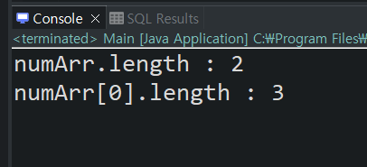

다차원 배열
====================


### 다차원 배열의 행과 열의 수 출력

아래와 같이 참조변수명.length를 할 때에는 그 참조변수 행의 갯수를 반환한다.


열의 수를 알고 싶으면 배열 안의 배열의 접근하여 length를 입력하면 출력하면 된다.
```
public class Main {
    public static void main(String[] args) {
    	int[][] numArr = {
						{10,20,30},
						{1,2,3},
    					};
    	System.out.println("numArr.length : " + numArr.length);
    	System.out.println("numArr[0].length : " + numArr[0].length);
    }
}
```





### for each문으로 2차원 배열의 요소 출력하기


출력할 때는 정말 편하게 쓸 수 있는 for each문이지만, for each문으로 배열에 저장된 값을 변경할 수는 없다.
```
public class Main {
    public static void main(String[] args) {
    	int[][] numArr = {
						{10,20,30},
						{1,2,3},
    					};
    	
    	for(int[] i : numArr) {
    		for(int num : i) {
    			System.out.print(num + " ");
    		}
    		System.out.println();
    	}
    }
}
```


