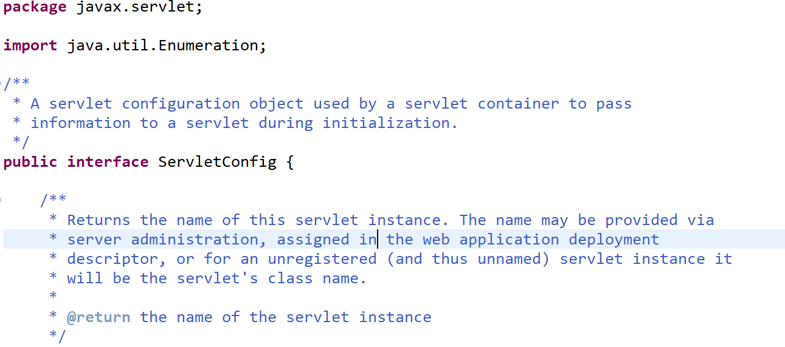

Servlet API 사용하기
===================


```
1. https://tomcat.apache.org/download-80.cgi#8.0.53
   위의 링크로 접속한다.

2. 스크롤를 쭉 내려서 Source Code Distributions 박스의 zip 파일을 다운 받는다.

3. 다운 받은 zip 파일의 압축을 푼다.

4. 폴더 경로를 추가한다.
    지금은 추가해서 오류 창을 예시로 올릴 수 없다.
    자바 API를 이용하는 것처럼 ctrl 키를 누른 상태에서 자신이 알고 싶은 메소드나 클래스를 클릭하면
    영문으로 무언갈 추가하라며 attach source 버튼이 있을 거다.
    그 버튼을 클릭하고 external File를 클릭한 후 위에서 다운 받아 압축 푼 폴더 경로를 추가해주면 된다.
```



이렇게 아름답게 servlet API를 사용할 수 있다.