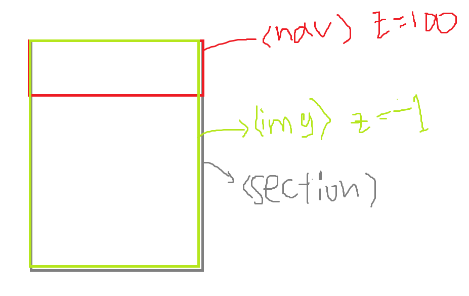

```
2022년 04월 04일

brezeefy 사이트를 따라 코딩을 해보았다.

클론 코딩을 하며 새롭게 알게 된 내용을 적겠다.
```

1. 크롤 할 시 부드럽게 움직이기
```
html {
    scroll-behavior: smooth;
}

```

2. 전체 body 기준으로 각 엘리먼트 여백 없애기
```
*{margin:0;padding:0;}
```

3. 아래의 속성을 추가하면 부드럽게 이벤트가 진행된다.


예를 들면 hover 시 font color를 변경할 때 아래의 코드를 처럼 작성하면


아릅답게 이벤트를 추가할 수 있다.
```
transition: all 0.5s ease-in-out;
```


4. 이번 클론 코딩의 꽃 🌺


이미지 슬라이드를 구현해보았다.
```
ul,li{list-style:none;}
.slide{
    background-color: white;
    height:560px;
    overflow:hidden;
    margin-top: 15rem;
    width: 1525px;
    position: relative;
    top: -.5rem;
    cursor: pointer;
}
.slide ul{width:calc(100% * 5);display:flex;animation:slide 30s infinite;} /* slide를 30초동안 진행하며 무한반복 함 */
.slide li{width:calc(100% / 5);height:555px;}
.slide li:nth-child(1) {
    background-image: url("sildeImg/slideImg1.png");
    background-size: contain;
    position: relative;
    left: 4rem;
}
.slide li:nth-child(2){
    background-image: url("sildeImg/slideImg2.png");
    background-size: contain;
    position: relative;
    left: 4rem;
}
.slide li:nth-child(3){
    background-image: url("sildeImg/slideImg3.png");
    background-size: contain;
    position: relative;
    left: 4rem;
}
.slide li:nth-child(4){
    background-image: url("sildeImg/slideImg4.png");
    background-size: contain;
    position: relative;
    left: 4rem;
}

.slide li:nth-child(5){
    background-image: url("sildeImg/slideImg5.png");
    background-size: contain;
    position: relative;
    left: 4rem;
}
@keyframes slide {
  0% {margin-left:0;} /* 0 ~ 10  : 정지 */
  10% {margin-left:0;} /* 10 ~ 25 : 변이 */
  25% {margin-left:-100%;} /* 25 ~ 35 : 정지 */
  35% {margin-left:-100%;} /* 35 ~ 50 : 변이 */
  50% {margin-left:-200%;}
  60% {margin-left:-200%;}
  75% {margin-left:-300%;}
  85% {margin-left:-300%;}
  100% {margin-left:0;}
}
```

5. z-index를 사용하여 상반바를 고정시키는 방법을 알고 있었다.


사이트를 들어가 스크롤을 내리면 back 이미지는 고정된 채로 메인 섹션이 움직이는 걸 구현해보았다.



```
1. 상반바의 z는 100으로 설정했다. position은 fixed.
2. 메인은 설정하지 않았다.
   메인 어디에든 img 태그를 입력하여 position-fixed를 하게 되면 자꾸 이미지가 사라졌다.
3. 여기저기 방법을 찾다가 z 100인 상단바 태그 안 상위에 img 태그를 입력하고 하니 position-fixed 이미지가 사라지지 않았다.
```

6. 제품에 마우스 이벤트할 때 배경화면으로 이미지가 보이게 구현해보았다. 원 사이트에서는 부드럽게 나타났다.


그걸 구현해보고 싶었지만 아직 방벙을 찾지 못했다.


```
코딩의 꽃은 구글링이다.
구글링하면 정말 안 나오는 게 없다.
나중에는 사이트를 동적으로 구현하는 방법까지 해보겠다.
한 번 시작한 거 완벽하게 만들어보자.
```
